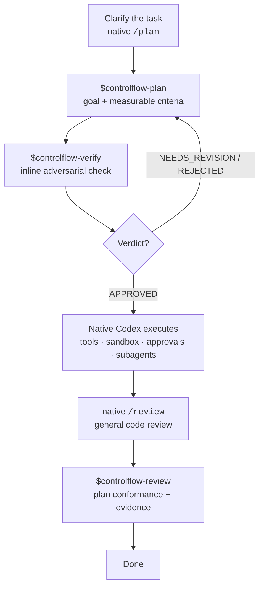
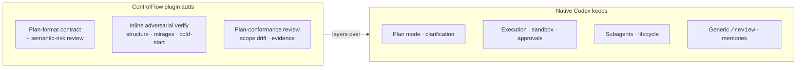

# ControlFlow for Codex

> A slim planning-quality plugin for native Codex: durable plans, adversarial
> verification, and plan-aware review — without duplicating what Codex already does.

**3 skills, 0 subagents.** The plugin keeps the ControlFlow plan format, tier-gated
semantic-risk review, and evidence discipline, then hands execution back to native
Codex. It installs no router, runtime policy, approval engine, retry scheduler, or
custom subagents.

This repository is the standalone home of the ControlFlow-for-Codex plugin.

The core feedback loop is: clarify uncertain context, state the user-facing goal,
define measurable success criteria, verify that the plan is executable, execute in
native Codex, and review the final evidence against the approved goal and criteria.

## How it fits with native Codex



## What the plugin owns vs. what Codex owns



## Skills

| Skill | Purpose |
| --- | --- |
| `$controlflow-plan` | Save a durable, tiered, semantic-risk-reviewed plan under `plans/` |
| `$controlflow-verify` | Verify the saved plan inline: structure, mirages, and cold-start executability |
| `$controlflow-review` | Compare implementation and test evidence with the approved plan |

Each skill is a single self-contained `SKILL.md` (references inlined), plus an optional
`agents/openai.yaml` for host UI metadata. There are no reference files and no subagents.

When the active repository contains `schemas/planner.plan.schema.json` and
`plans/templates/plan-document-template.md`, those files override the bundled plan-format
fallback.

## Installation

```powershell
powershell -ExecutionPolicy Bypass -File scripts/install.ps1
```

Use `-Force` to replace an existing installation. To remove:

```powershell
powershell -ExecutionPolicy Bypass -File scripts/install.ps1 -Uninstall -Force
```

This copies the plugin into `$HOME/plugins/controlflow-codex` and registers a local
marketplace entry at `$HOME/.agents/plugins/marketplace.json`.

## Deterministic validator

`scripts/validate-plan.ps1` is the only executable logic in the plugin. It checks the
plan header, required sections, lifecycle heading order, the seven semantic-risk rows
(each exactly once), and (with `-RequireVerifyVerdict`) the `verify-verdict.md` shape.

```powershell
powershell -ExecutionPolicy Bypass -File scripts/validate-plan.ps1 `
  -RepoRoot . `
  -PlanPath plans/my-task-plan.md `
  -RequireVerifyVerdict
```

## When you don't need it

For an obvious one- or two-file change, use native Codex directly — no plan artifact,
no verify, no review. The `TRIVIAL` tier exists exactly for this.

## Repository layout

```
.codex-plugin/plugin.json        plugin manifest
assets/controlflow-codex-logo.svg logo
skills/controlflow-plan/          $controlflow-plan  (SKILL.md + agents/openai.yaml)
skills/controlflow-verify/        $controlflow-verify
skills/controlflow-review/        $controlflow-review
scripts/install.ps1               install / -Uninstall
scripts/validate-plan.ps1         plan-format + verify-verdict validator
README.md · CHANGELOG.md · LICENSE
```

## License

MIT — see [LICENSE](LICENSE).
