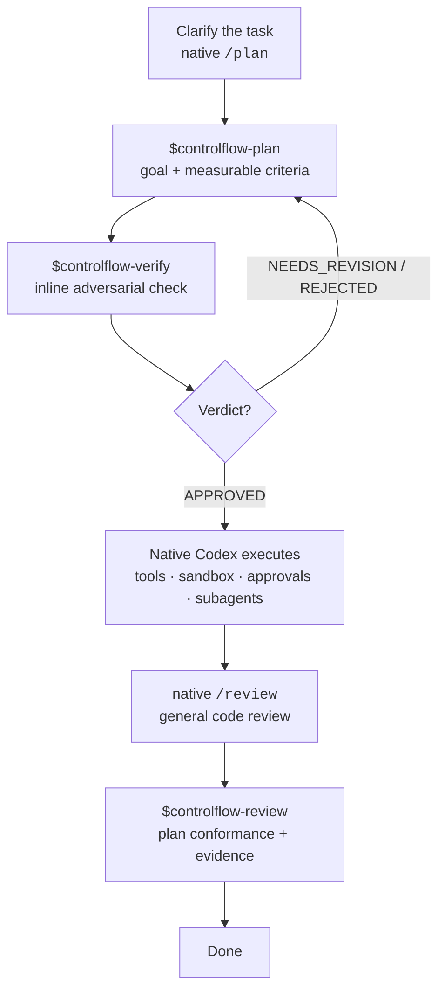
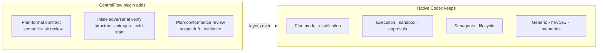

# ControlFlow for Codex

> A slim planning-quality plugin for native Codex: durable plans, adversarial
> verification, and plan-aware review — without duplicating what Codex already does.

**3 skills, 0 subagents.** The plugin keeps the ControlFlow plan format, tier-gated
semantic-risk review, and evidence discipline, then hands execution back to native
Codex. It installs no router, runtime policy, approval engine, retry scheduler, or
custom subagents.

This repository is the standalone home of the ControlFlow-for-Codex plugin.

The core feedback loop is: clarify uncertain context, state the user-facing goal,
define measurable success criteria, verify that the plan is executable, execute in
native Codex, and review the final evidence against the approved goal and criteria.

## How it fits with native Codex



## What the plugin owns vs. what Codex owns



## Skills

| Skill | Purpose |
| --- | --- |
| `$controlflow-plan` | Save a durable, tiered, semantic-risk-reviewed plan under `plans/` |
| `$controlflow-verify` | Verify the saved plan inline: structure, mirages, and cold-start executability |
| `$controlflow-review` | Compare implementation and test evidence with the approved plan |

Each skill is a single self-contained `SKILL.md` (references inlined), plus an optional
`agents/openai.yaml` for host UI metadata. There are no reference files and no subagents.

When the active repository contains `schemas/planner.plan.schema.json` and
`plans/templates/plan-document-template.md`, those files override the bundled plan-format
fallback.

## Installation

```powershell
powershell -ExecutionPolicy Bypass -File scripts/install.ps1
```

Use `-Force` to replace an existing installation. To remove:

```powershell
powershell -ExecutionPolicy Bypass -File scripts/install.ps1 -Uninstall -Force
```

This copies the plugin into `$HOME/plugins/controlflow-codex` and registers a local
marketplace entry at `$HOME/.agents/plugins/marketplace.json`.

## Deterministic validator

`scripts/validate-plan.ps1` checks the plan header, required sections, lifecycle
heading order, the seven semantic-risk rows (each exactly once), and (with
`-RequireVerifyVerdict`) the `verify-verdict.md` shape.

## Structured plan metadata

Every new non-trivial ControlFlow plan can pair its Markdown artifact with
`plans/artifacts/<task>/plan.meta.json`. The bundled
`schemas/plan-meta.schema.json` defines the portable sidecar format: goal, tier,
phases, dependencies, planned files, commands, semantic risks, and success
criteria. Markdown remains the human-readable plan; metadata enables deterministic
validation and future plan-aware comparison without adding a runtime service.

Use `-RequirePlanMetadata` to validate the sidecar and its synchronization with
the Markdown goal, tier, and phase IDs. The option is intentionally opt-in so
existing Markdown-only plans remain supported.

## Deterministic plan scoring

`scripts/score-plan.ps1` reads a saved plan, its metadata sidecar, and its
verifier verdict, then emits one JSON object with `aggregate_score`, a
deterministic verdict, metrics, and diagnostic issues. It does not execute
declared plan commands or call external services.

The six 0-100 metrics are `completeness`, `executability`,
`criteria_coverage`, `dependency_sanity`, `risk_coverage`, and
`evidence_readiness`. `APPROVED` requires every metric to be at least 80;
otherwise an aggregate score of at least 50 is `NEEDS_REVISION`, and a lower
score is `REJECTED`. These are reproducible plan-quality signals, not a
replacement for `$controlflow-verify`'s adversarial review or native Codex
approval decisions.

```powershell
powershell -ExecutionPolicy Bypass -File scripts/score-plan.ps1 -RepoRoot . -PlanPath plans/my-task-plan.md
```

## Plan templates

`plans/templates/` contains paired Markdown and JSON skeletons for `bugfix`,
`refactor`, `migration`, `feature`, and `docs-test-only` work. They are not
validated execution plans: copy the relevant pair, replace every authoring
marker with verified repository evidence and exact commands, then save the
grounded artifacts under the normal `plans/` and `plans/artifacts/` locations.

Choose a template only when the task type is clear. When the choice affects
scope, rollback, or safety, clarify first instead of treating a template as an
automatic planner or runtime mechanism.

```powershell
powershell -ExecutionPolicy Bypass -File scripts/validate-plan.ps1 `
  -RepoRoot . `
  -PlanPath plans/my-task-plan.md `
  -RequirePlanMetadata `
  -RequireVerifyVerdict
```

## Context snapshot

`scripts/snapshot-context.ps1` captures the repository state immediately before
planning: git branch, HEAD commit, dirty flag, sorted tracked file tree,
tracked file count, and a SHA-256 file-tree digest. The planner saves the JSON
output to `plans/artifacts/<task>/context-snapshot.json` so later review can
compare the final state against the pre-planning baseline.

The script reads git state only and never executes plan commands. It is
evidence of the starting point, not a planning gate or runtime dependency.

```powershell
powershell -ExecutionPolicy Bypass -File scripts/snapshot-context.ps1 `
  -RepoRoot . `
  -PlanPath plans/my-task-plan.md
```
## Scope drift detection

`scripts/detect-drift.ps1` compares the actual changed file paths (from git
diff) against the planned files in `plan.meta.json`. When a
`context-snapshot.json` exists, it uses the snapshot's HEAD commit as the diff
base; otherwise it falls back to `HEAD~1`. Each changed path is classified as
`approved_follow_through`, `justified_deviation`, or `blocking_scope_drift`.
The output also lists `planned_but_unchanged` files for informational purposes.

The verdict is `CLEAN` when no blocking scope drift is found, or
`DRIFT_DETECTED` when unplanned files appear in the diff. The script reads git
state only and never executes plan commands.

```powershell
powershell -ExecutionPolicy Bypass -File scripts/detect-drift.ps1 `
  -RepoRoot . `
  -PlanPath plans/my-task-plan.md
```

## Release workflow

`scripts/release.ps1` packages the plugin, creates a semver tag, and
smoke-installs the package in a clean temp directory. It updates the version in
`plugin.json`, runs the full contract suite (unless `-SkipTests`), creates a zip
under `dist/`, extracts and installs it into an isolated home, verifies the
marketplace entry, and uninstalls to confirm cleanup.

```powershell
powershell -ExecutionPolicy Bypass -File scripts/release.ps1 `
  -RepoRoot . `
  -Version 1.1.0
```

Use `-SkipTag` when git is read-only or the tag already exists, and `-SkipTests`
to skip the contract suite (for example, when tests were already run in CI).

## When you don't need it

For an obvious one- or two-file change, use native Codex directly — no plan artifact,
no verify, no review. The `TRIVIAL` tier exists exactly for this.

## Repository layout

```
.codex-plugin/plugin.json        plugin manifest
assets/controlflow-codex-logo.svg logo
skills/controlflow-plan/          $controlflow-plan  (SKILL.md + agents/openai.yaml)
skills/controlflow-verify/        $controlflow-verify
skills/controlflow-review/        $controlflow-review
scripts/install.ps1               install / -Uninstall
scripts/validate-plan.ps1         plan-format + metadata + verify-verdict validator
scripts/score-plan.ps1            deterministic plan artifact scorer (JSON)
scripts/snapshot-context.ps1      pre-planning context snapshot (JSON)
scripts/detect-drift.ps1         scope drift detector (JSON)
scripts/release.ps1               release packaging, tag, and smoke-install
schemas/plan-meta.schema.json     structured plan-sidecar contract
README.md · CHANGELOG.md · LICENSE
```

## License

MIT — see [LICENSE](LICENSE).
